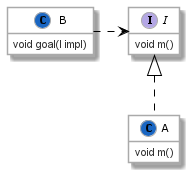
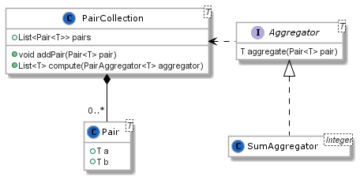
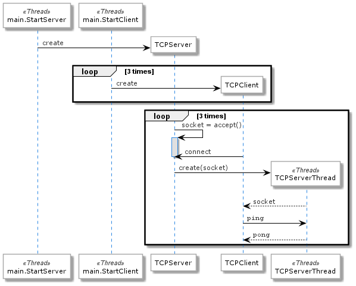

# [Paradigmas de Programação 2020/2021](https://elearning.ual.pt/course/view.php?id=1946), [UAL](https://autonoma.pt/)

## Laboratório 5: *Lambda*

Este laboratório propõe exercícios focados em expressões *lambda* em Java (JDK >= 8).

### Contexto

A infraestrutura Java permite oferecer uma interface funcional, que possibilita a declaração sintética de
funcionalidade, sem recorrer explicitamente a instruções.

A construção fundamental `() -> { }` representa a instanciação de um objeto com um único método, cujo tipo está definido
por uma interface.

## Tarefas

### Tarefa 1

Considere o seguinte modelo:



A implementação é a seguinte:

```java
interface I {
    void m();
}

class A implements I {
    @Override
    public void m() {
        System.out.println("m implemented in A");
    }
}

class B {
    public void goal(I impl) {
        System.out.print("B is executing goal: ");
        impl.m();
    }
}

public class App {
    public static void main(String[] args) {
        B b = new B();
        A a = new A();
        b.goal(a);
    }
}
```

Reescreva o código, utilizando expressões lambda.

### Tarefa 2

Considere uma coleção de pares de valores. A coleção permite aplicar um método agregador aos pares, e produzir coleções de valores singulares (resultantes da agregação).

O agregador `SumAggregator` opera sobre pares de valores inteiros, e soma os dois valores no par.



Considere a seguinte implementação do modelo, com um programa que produz a soma de todos os pares de uma coleção de pares inteiros:

```java
import java.util.ArrayList;
import java.util.List;

interface PairAggregator<T> {
    T aggregate(Pair<T> pair);
}

class Pair<T> {
    private final T a;
    private final T b;

    public Pair(T a, T b) {
        this.a = a;
        this.b = b;
    }

    public T getA() { return a; }

    public T getB() { return b; }
}

class PairCollection<T> {
    private final List<Pair<T>> pairs = new ArrayList<>();

    void addPair(Pair<T> pair) { pairs.add(pair); }

    List<T> compute(PairAggregator<T> aggregator) {
        ArrayList<T> result = new ArrayList<>();
        for(final var pair : pairs) {
            result.add(aggregator.aggregate(pair));
        }
        return result;
    }
}

class SumPairs implements PairAggregator<Integer> {
    @Override
    public Integer aggregate(final Pair<Integer> pair) {
        return pair.getA() + pair.getA();
    }
}

public class App {
    public static void main(String[] args) {
        PairCollection<Integer> intPairs = new PairCollection<>();
        intPairs.addPair(new Pair<Integer>(10, 1));
        intPairs.addPair(new Pair<Integer>(20, 2));
        intPairs.addPair(new Pair<Integer>(30, 3));

        List<Integer> results = intPairs.compute(new SumPairs());
        for(final var result : results) {
            System.out.println(result);
        }
    }
}
```

a) Reescreva a aplicação do agregador para a soma de inteiros utilizando lambdas.

b) Escreva agregadores para subtração, multiplicação, e divisão.

### Tarefa 3
Considere a seguinte aplicação cliente-servidor, que permite iniciar um servidor sobre sockets TCP, que responde a pedidos `ping` com a expressão `pong`.



Considere a seguinte implementação do sistema:
```java
import java.io.IOException;
import java.io.PrintWriter;
import java.net.ServerSocket;
import java.net.Socket;
import java.util.Scanner;

class TCPClient {
    public TCPClient() throws IOException {
        final Socket socket = new Socket("127.0.0.1", 4242);
        try {
            final var printWriter = new PrintWriter(socket.getOutputStream());
            final var scanner = new Scanner(socket.getInputStream());
            printWriter.println("ping");
            printWriter.flush();
            System.out.println("Server replied: " + scanner.nextLine());
            printWriter.close();
            scanner.close();
            socket.close();
        } catch(IOException e) {
            e.printStackTrace();
        }
    }
}

class TCPServer {
    public TCPServer() throws IOException {
        final ServerSocket serverSocket = new ServerSocket(4242);
        var count = 0;
        while(count < 3) {
            count++;
            Socket socket = serverSocket.accept();
            new TCPServerThread(socket).start();
        }
        serverSocket.close();
    }
}

class TCPServerThread extends Thread {
    private final Socket socket;

    public TCPServerThread(final Socket socket) {
        this.socket = socket;
    }

    @Override
    public void run() {
        try {
            final var printWriter = new PrintWriter(socket.getOutputStream());
            final var scanner = new Scanner(socket.getInputStream());
            System.out.println("Client sent: " + scanner.nextLine());
            printWriter.println("pong");
            printWriter.flush();
            printWriter.close();
            scanner.close();
            socket.close();
        } catch(IOException e) {
            e.printStackTrace();
        }
    }
}

public class TCPClientServer {
    public static void main(String[] args) {
        new Thread(new Runnable() {
            @Override
            public void run() {
                try {
                    new TCPServer();
                } catch(IOException e) {
                    e.printStackTrace();
                }
            }
        }).start();
        for(int i = 0; i < 3; i++) {
            new Thread(new Runnable() {
                @Override
                public void run() {
                    try {
                        new TCPClient();
                    } catch(IOException e) {
                        e.printStackTrace();
                    }
                }
            }).start();
        }
    }
}
```

Substitua as implementações de `Runnable` com expressões lambda.